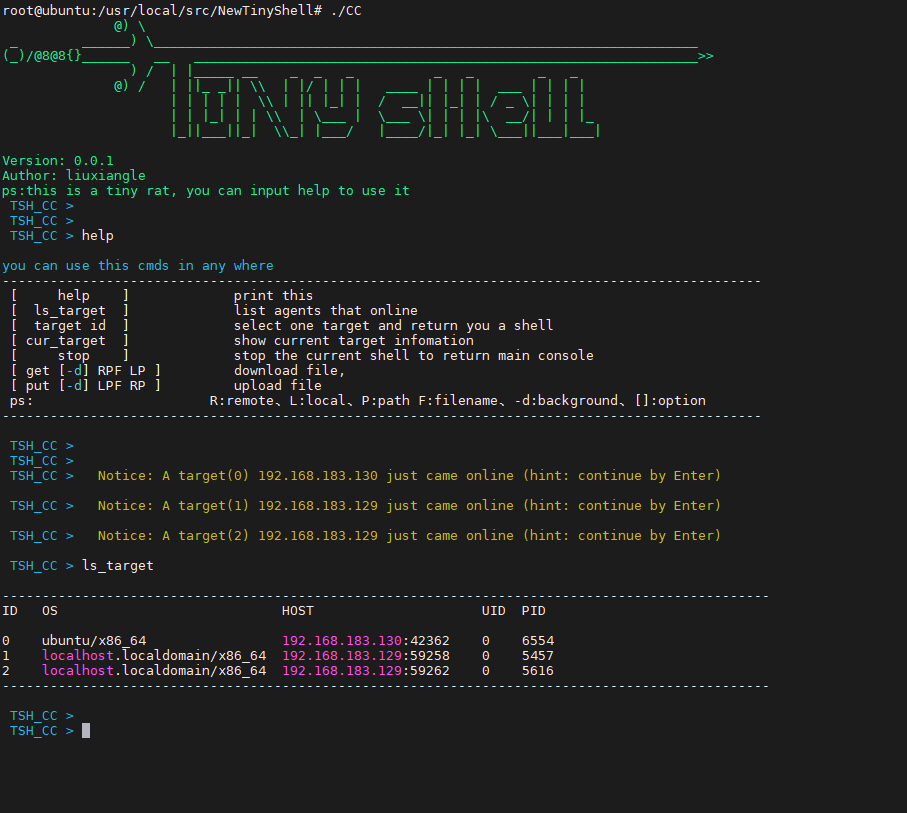
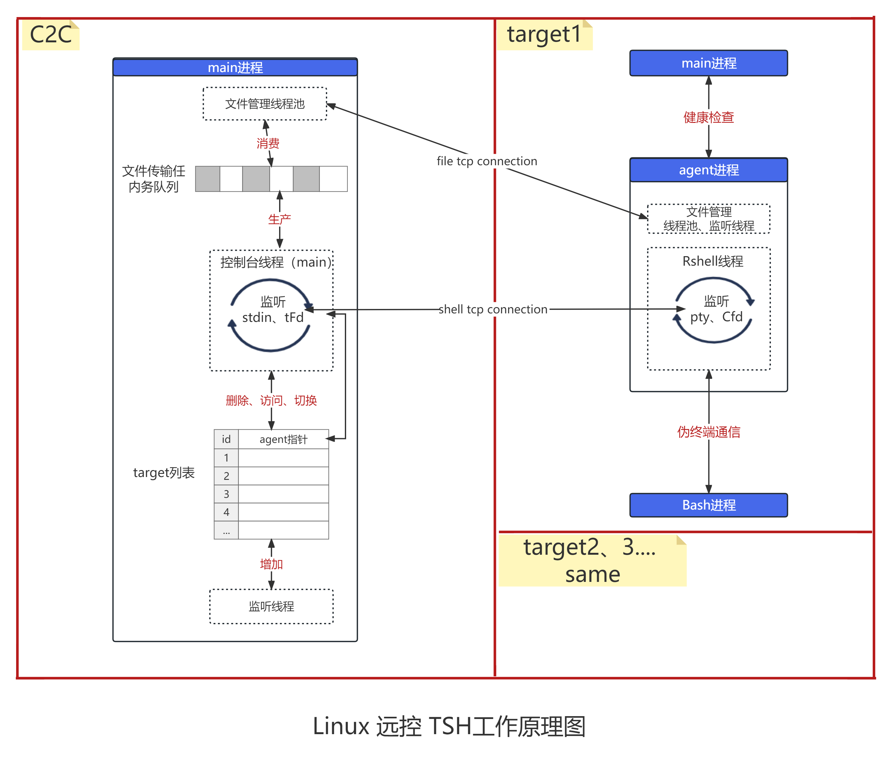

## Linux TinyShell

a simple Command-Line-Rat-Tool with C++ for Linux

## Features

done:

* 反弹交互式shell
* 文件下载（断点续传、分片、进度条、同步异步两种模式）
* http协议
* 快速切换session， session列表增删改查
* agent保活：健康检查

planed for future

* 流量加密：aes对称加密、https
* agent开机自启 正向建立连接
* 文件上传

## Screenshot

more in img

## how to work

## how to use

1. set: core/setting.h 、Log/log.conf
2. make

## 优化
